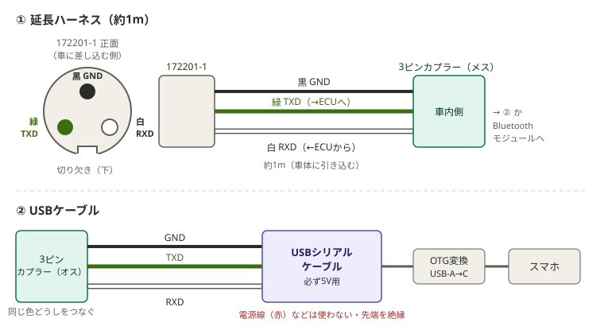
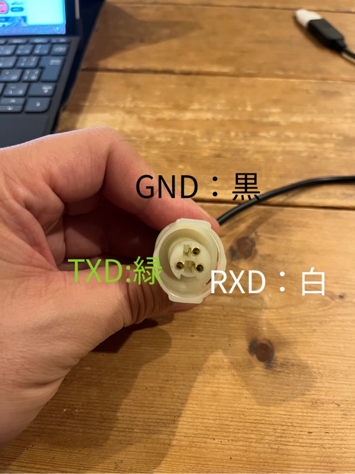

# 延長ハーネスとUSBケーブルの作り方

車の診断カプラーとスマホをつなぐための部品を作ります。

| パーツ | 役目 |
|---|---|
| **① 延長ハーネス**（約1m） | 車の診断カプラーから車内まで線を引き込む。先端は3ピンカプラー（メス） |
| **② USBケーブル** | ①の3ピンカプラーとスマホをUSBでつなぐ |
| **③ [Bluetoothモジュール](../firmware/atom_lite_bridge/README.md)** | ①の3ピンカプラーとスマホをBluetoothでつなぐ |

①は車に付けたままにしておき、使う時に②か③を挿します。

## ① 延長ハーネス

### 必要な部品

| 部品 | 目安 |
|---|---|
| カプラー＋ゴム栓（タイコエレクトロニクス 172201-1） | [楽天（ik21）](https://item.rakuten.co.jp/ik21/10111335/)。車の診断カプラー（172202-1）に挿さる側 |
| 端子（タイコエレクトロニクス 170280-1） | [楽天（ik21）](https://item.rakuten.co.jp/ik21/10111315/)。10個入りで、使うのは3個（AWG20〜16の線用） |
| 電線 3本（黒・緑・白、各約1m） | AWG20前後 |
| 3ピンカプラー（車内側） | オス・メスの組。**メス側を①に**、オス側を②・③に付ける（下の「3ピンカプラーについて」） |

道具: 端子を線にかしめる圧着ペンチ、ニッパー、ビニールテープ（または熱収縮チューブ）

### 作り方

1. 3本の線の片側に 170280-1 の端子をかしめる（ゴム栓を先に線に通しておく）
2. 下の表のとおり 172201-1 に挿す
3. 反対側に3ピンカプラーの**メス側**を付ける（どの色をどの位置にしたか控えておき、②・③も同じ並びにする）

| 線 | 名前 | 172201-1 の穴 |
|---|---|---|
| 黒 | GND（アース） | 上 |
| 緑 | TXD（スマホ → 車のコンピューター） | 左下 |
| 白 | RXD（車のコンピューター → スマホ） | 右下 |

穴の位置は、**車に差し込む側から、下側の切り欠きを下にして見たとき**の位置です。

### クロス配線について（172201-1 の所で入れ替わっています）

通信の線は「送る線」と「受け取る線」の2本で、**片方の「送る」を、相手の「受け取る」につなぐ**必要があります。この「送る⇔受け取る」の入れ替えを**クロス配線**と呼びます。

この延長ハーネスでは、**172201-1 の所でクロスしています**。

| 172201-1 の穴 | 車のコンピューター側 | ハーネスの線（スマホ側から見た名前） |
|---|---|---|
| 左下 | 受け取る線 | 緑 TXD（スマホが送る） |
| 右下 | 送る線 | 白 RXD（スマホが受け取る） |

線の名前（TXD・RXD）は、USBシリアルケーブルの印字に合わせて**スマホ側から見た名前**で付けています。そのため、172201-1 から先は「TXD は TXD に、RXD は RXD に」と**同じ名前・同じ色どうしをつなぐだけ**で正しくつながります（②のUSBケーブルも、Bluetoothモジュールも同じ）。

**途中でもう一度入れ替えないでください。** 二重にクロスすると元に戻ってしまい、送る線どうし・受け取る線どうしがつながって通信できなくなります（開発中に実際にこれで1週間ほど悩みました）。

### 3ピンカプラーについて

車内側の3ピンカプラーの種類は自由です（手に入りやすいもので構いません）。守ってほしいのは2つだけです。

> [!IMPORTANT]
> **3ピンカプラーをはさんで、必ず同じ色どうしをつないでください。**（黒は黒、緑は緑、白は白）
> ②・③の線の色が①と違う場合は、②の表のように TXD・RXD の名前で①の色に合わせます。

- **①側をメス、②・③側をオスにする**: 電気の世界では「電気が来ている側（つなぐ前から生きている側）をメス」にするのが基本です。ピンが奥に引っ込んでいるので、外したまま車内にぶら下げておいても、車体や工具に触れてショートしにくくなります。①は車に付けっぱなしで、キーONの間は車のコンピューターにつながった線が来ているので、①がメスです

## ② USBケーブル

### 必要な部品

| 部品 | 目安 |
|---|---|
| USBシリアル変換ケーブル（**5V用**） | おすすめは FTDI TTL-232R-5V（[秋月電子 通販コード 105841](https://akizukidenshi.com/catalog/g/g105841/)、約3,800円） |
| 3ピンカプラー（オス側） | ①で用意した組の片方 |
| OTG変換アダプタ（USB-A メス → USB-C） | スマホの差し込み口に合わせる |

> [!IMPORTANT]
> **USBシリアルケーブルは、必ず「5V」のものを選んでください。**
> 車のコンピューター（MEMS）は5Vの信号でやり取りします。3.3V用のケーブルでは、信号が弱くて通信できないことがあります。
> 「5V」と書いてあっても、それが**電源の線（赤）の電圧のことで、信号は3.3V**という商品もあります。信号（TXD・RXD）が5Vかどうかを確かめてください。
> 「5V/3.3V切り替え」と書かれた基板タイプには、電源だけが切り替わって信号は3.3Vのままのものがあるので避けてください。

アプリが対応しているのは、FTDI（FT232）・Prolific（PL2303）・Silicon Labs（CP210x）・CH340 のチップを使ったケーブルです。

### 作り方

1. USBシリアルケーブルの先端のコネクターを切り落とす
2. 使う3本（GND・TXD・RXD）を3ピンカプラーの**オス側**に付ける。**①と同じ色の位置**に、同じ名前の線が来るようにします
3. 残りの線（電源の赤など）は使いません。先端を1本ずつビニールテープ等で絶縁して、ほかの線や車体に触れないようにする

線の色はケーブルによって違います。**色ではなく、TXD・RXD の名前で合わせてください。**

| ①の線 | FTDI TTL-232R-5V の線 | waves PL2303HX（みんカラで使用）の線 |
|---|---|---|
| 黒 GND | 黒（GND） | 黒（GND） |
| 緑 TXD | **橙**（TXD） | 緑（TXD） |
| 白 RXD | **黄**（RXD） | 白（RXD） |
| 使わない | 赤（VCC）・茶（CTS）・**緑（RTS）** | 赤（5V） |

FTDIのケーブルでは**緑は RTS という別の線**です。①の緑（TXD）につながないよう注意してください。

緑と白（TXD と RXD）を入れ替えると通信できません。

## 車へのつなぎ方

1. ①を車の診断カプラーに差し込み、線を車内に引き込む
2. ①の3ピンカプラーに②を挿し、OTG変換アダプタでスマホにつなぐ
3. キーを ON にして、アプリの接続画面で「USB」を選ぶ

初めてつないだ時は「USBへのアクセスを許可しますか？」と出るので、許可してください。

## 参考

みんカラで使っていた waves PL2303HX は、現在は販売が終わっているようです。

みんカラの整備手帳「[ECU診断機 MEMSケーブル作成](https://minkara.carview.co.jp/userid/3582905/car/3503016/7526089/note.aspx)」（172201-1 に直接USBシリアルケーブルを付ける作り方）を元にしています。
