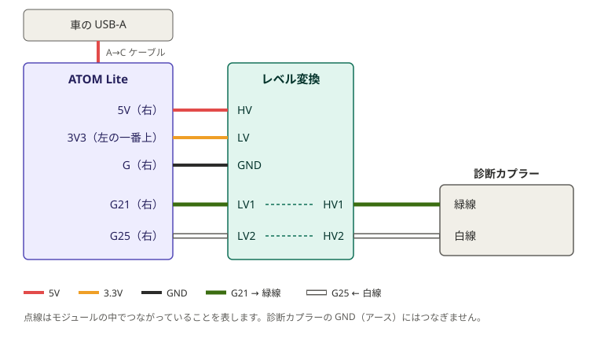

# Bluetooth モジュールの作り方（M5Stack ATOM Lite）

スマホと車の診断カプラーを、ケーブルなしでつなぐための小さな中継器を作ります。作ったモジュールは、RoverMEMS アプリの接続画面に **`RoverMEMS-xxxx`** という名前で表示されます。

実車（1996年式ミニSPi / MEMS 1.3）で、接続・ライブデータ表示・エンジン始動後の自動つなぎ直しまで確認しています。

## 必要な部品

| 部品 | 目安 |
|---|---|
| M5Stack ATOM Lite | [秋月電子 通販コード 117209](https://akizukidenshi.com/catalog/g/g117209/)（税込1,980円） |
| 双方向レベル変換モジュール（秋月電子 AE-LCNV4-MOSFET） | [秋月電子 通販コード 113837](https://akizukidenshi.com/catalog/g/g113837/)（税込200円）。ATOM Lite（3.3V）と車（5V）の電圧の違いを吸収する |
| ジャンパワイヤ（オス－メス） | 7本。[秋月電子 通販コード 117228](https://akizukidenshi.com/catalog/g/g117228/)（コネクター付ケーブル 20cm 40P オスメス、税込180円） |
| USB-A → USB-C ケーブル（データ対応） | 100均で購入できる。プログラムの書き込みと、車での電源に使う |
| 3ピンカプラー（オス側）＋電線（緑・白） | [延長ハーネス①](../../cable/README.md)の3ピンカプラーと対になる側 |

車の診断カプラーには、[延長ハーネス①](../../cable/README.md)を通してつなぎます（USBケーブル②と共通の部品です）。

## 1. プログラムの書き込み（最初の1回だけ）

パソコン（Windows）で行います。

1. **Arduino IDE をインストール**: https://www.arduino.cc/en/software （無料）
2. **ESP32 の追加**: Arduino IDE を開き、左側の「ボードマネージャ」（基板のアイコン）で `esp32` と検索し、**esp32 by Espressif Systems** をインストール
3. **プログラムをダウンロード**: [RoverMEMS のトップページ](https://github.com/RoverMEMS/RoverMEMS)の緑の「**Code**」ボタン →「**Download ZIP**」。ダウンロードした ZIP を展開（右クリック →「すべて展開」）
4. **ATOM Lite をパソコンに USB でつなぐ**（データ通信対応のケーブルで）
5. **プログラムを開く**: Arduino IDE の「ファイル → 開く」で、展開したフォルダの中の `firmware/atom_lite_bridge/atom_lite_bridge.ino` を選ぶ
6. **ボードの選択**: メニュー「ツール → ボード → esp32 → **M5Atom**」（検索欄に atom と打つと早い）
7. **ポートの選択**: 「ツール → ポート」で COM○ を選ぶ（ATOM Lite を抜き差しすると増減するのがそれ）
8. **書き込み速度**: 「ツール → Upload Speed → **115200**」
9. **書き込み**: 左上の「→」ボタン。下の欄に `Hard resetting via RTS pin...` と出れば完了。**初回は準備に時間がかかります**（パソコンによっては20〜30分）

書き込み後、本体の LED が**青く点滅**していれば成功です。

うまくいかない時:
- ポートが出てこない → Windows の「デバイス マネージャー」を開く。「M5stack」に黄色の！マークが付いていれば、[FTDI 公式のドライバー](https://ftdichip.com/drivers/vcp-drivers/)を入れる。「M5stack」自体が出てこなければ、ケーブルが充電専用の可能性があるので別のケーブルで試す
- 書き込みの途中で失敗する → Upload Speed が 115200 になっているか確認

## 2. 家での動作確認（車に行く前に）

1. ATOM Lite の右側の穴の **G21 と G25 を、ジャンパワイヤ1本でつなぐ**（レベル変換モジュールはまだつながない）
2. USB 電源（パソコンや充電器）につなぐ → LED が青く点滅
3. アプリの接続画面で `RoverMEMS-xxxx` を選ぶ → LED が**緑**に変わり、**一瞬白く光れば**正常
4. 車につないでいないので、アプリは最後に「接続エラー」になります。これで問題ありません

## 3. 車への取り付け

家での確認で使った G21－G25 のジャンパは外してから配線します。

レベル変換モジュールは、片側（LV）が ATOM Lite 用、反対側（HV）が車用です。同じ番号の LV1 と HV1（LV2 と HV2）が中でつながっています。

**ATOM Lite → レベル変換モジュール**

| ATOM Lite | レベル変換モジュール |
|---|---|
| 5V（右側） | HV |
| 3V3（左側の一番上） | LV |
| G（右側） | GND（2つあるうちのどちらか1つ） |
| G21（右側） | LV1 |
| G25（右側） | LV2 |

**レベル変換モジュール → ①の3ピンカプラー**

| レベル変換モジュール | 診断カプラー |
|---|---|
| HV1 | 緑（TXD） |
| HV2 | 白（RXD） |

3ピンカプラーでは、**①と同じ色どうし**（緑は緑、白は白）がつながるようにしてください。

- ATOM Lite の穴には、ジャンパワイヤのオス側がそのまま挿さります
- ①の黒（GND）にはつなぎません（3ピンカプラーの黒の位置は空けておきます）。電源を車のUSBから取るので、アースは車体を通じて共通になっているためです。モバイルバッテリーなど車と関係ない電源で動かす時だけ、ATOM Lite の G を①の黒につないでください
- 電源は車の USB-A から A→C ケーブルで取ります。C→C ケーブルは電気が来ないことがあるので避けてください
- キーを START に回している間（セル中）は車の USB 電源が切れることが多く、そのとき接続も一度切れます。アプリが自動でつなぎ直すので、そのまま待てば数秒で表示が戻ります

## LED の意味

| LED | 状態 |
|---|---|
| 青の点滅 | スマホからの接続待ち |
| 緑 | スマホと接続中 |
| 白く一瞬光る | 車からデータを受信 |
